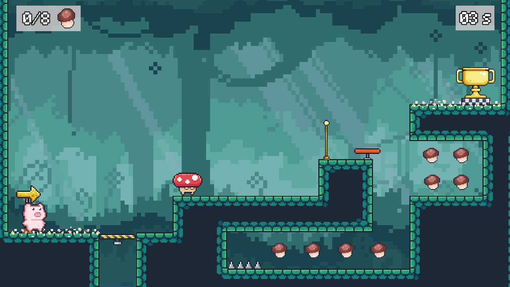
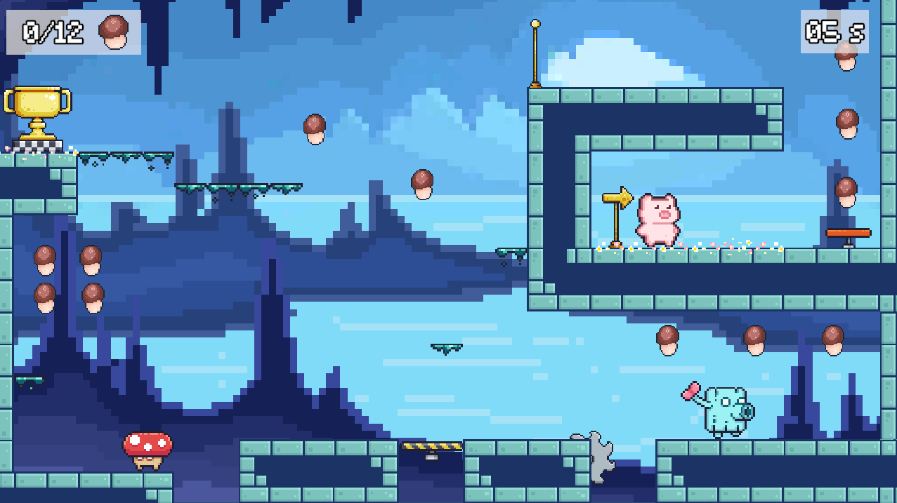
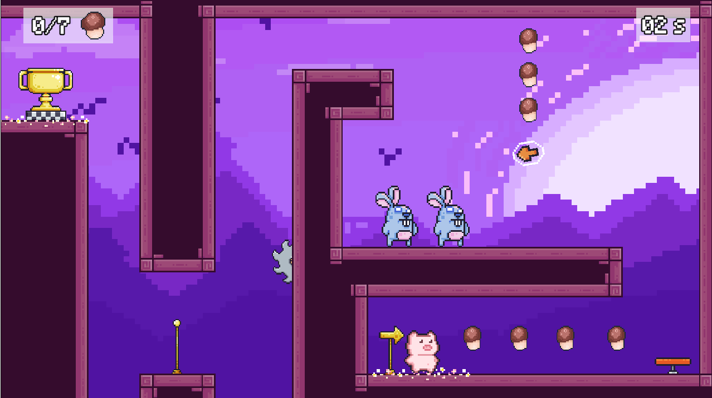
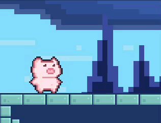
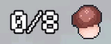

<h1 align="center">⁺˚⋆｡°🍄₊ ShroomVenture ₊🍄°｡⋆˚⁺</h1>

<p align="center">
  <em>A 2D platformer about a curious pink piglet lost in a dreamlike world of mushrooms.</em>
</p>

<p align="center">
  
  
  
  
</p>

<p align="center">
  <a href="https://xinyidou.itch.io/shroomventure">🎮 <strong>Play the demo on itch.io</strong></a>
</p>

---

## 📖 The Story

A curious pink piglet stumbles upon a strange, dreamlike world filled with mushrooms and
enemies. The piglet must collect ordinary mushrooms — and special ones that unlock unique
skins and abilities — while navigating a series of challenging platform puzzles.

The ultimate goal is to find a way back home by unraveling the mysteries of this surreal
world. Along the way, the piglet encounters various terrains, each with its own challenges
and wonders, testing both wit and agility. The journey is a blend of exploration,
discovery, and the quest to return to the familiar world left behind.

## 🗺️ Levels

Currently there are **3 levels**, with more under development.

<p align="center">
  
  
  
</p>

## 🐷 Characters

For now, the main playable character is **piglet**. More characters are under development.

<p align="center">
  
</p>

## 🎮 Abilities & Controls

| Ability | Control | Description |
|---------|---------|-------------|
| **Jump** | `Space` | Jump |
| **Double Jump** | `Space` ×2 | Jump twice; refreshes on touching ground |
| **Wall Jump** | *automatic* | Grab and leap off a wall in the opposite direction |
| **Wall Slide** | `Down` (on wall) | Slide down faster |
| **Kill Enemies** | *step on them* | Stomp enemies to defeat them |
| **Collect Mushrooms** | *jump on them* | Collect mushrooms scattered through the level |
| **Checkpoints** | *touch to activate* | Respawn at the last activated checkpoint on death |

<details>
<summary><strong>▶️ See it in action (click to expand the GIFs)</strong></summary>

### Jump


### Double Jump


### Wall Jump


### Wall Slide


### Killing Enemies


### Collecting Mushrooms



### Checkpoints & Respawn


</details>

## 🛠️ Development Log

**Design & Art**
- Created pixel art assets using **Aseprite** and CC0 assets from the **Unity Asset Store** — characters, terrain tiles, enemies, and environmental elements

**Development**
- Implemented core gameplay mechanics in **Unity** and **C#** — 2D platforming, collectibles, and puzzle-solving (in progress)
- Built the main character's movement, terrain interaction, and skin-unlocking through collecting unique mushrooms

**Level Design**
- Designed and integrated terrains with distinct visual styles and challenges for a cohesive, immersive experience

**Testing & Refinement**
- Iteratively tested and refined character controls, puzzle difficulty, and visual polish

## ⚠️ Still Under Development

- 🎥 **Camera Following** — smooth dynamic camera that tracks the player across terrains
- 💾 **Save System** — record progress and resume from specific points
- 🔊 **Audio SFX** — sound effects to deepen immersion
- 🎮 **New Input System & Gamepad Support** — Unity's new input system + controller support
- 📱 **Mobile Compatibility** — optimized touchscreen gameplay and controls
````

---

Copyright © Xinyi Dou
